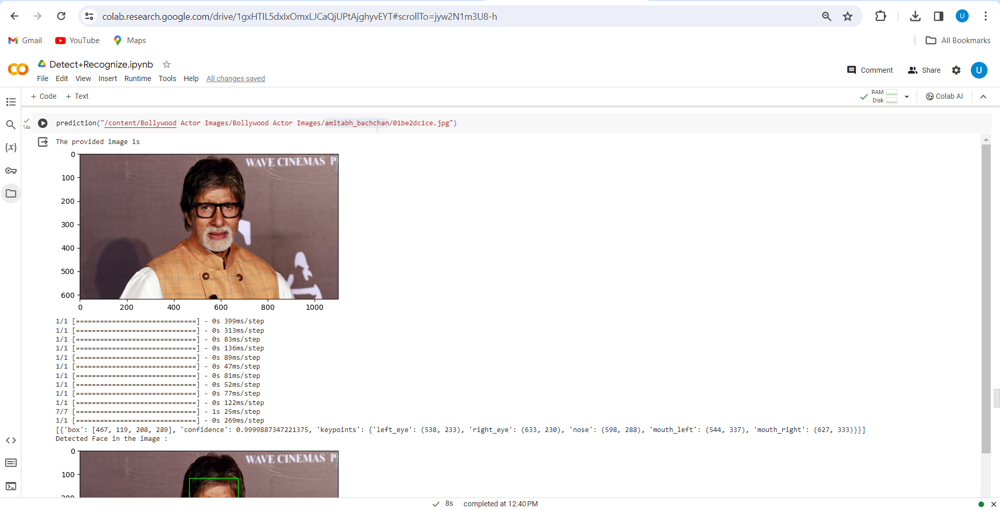
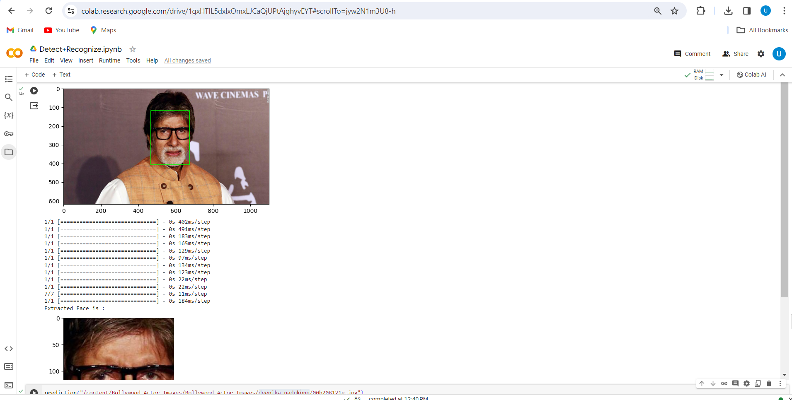
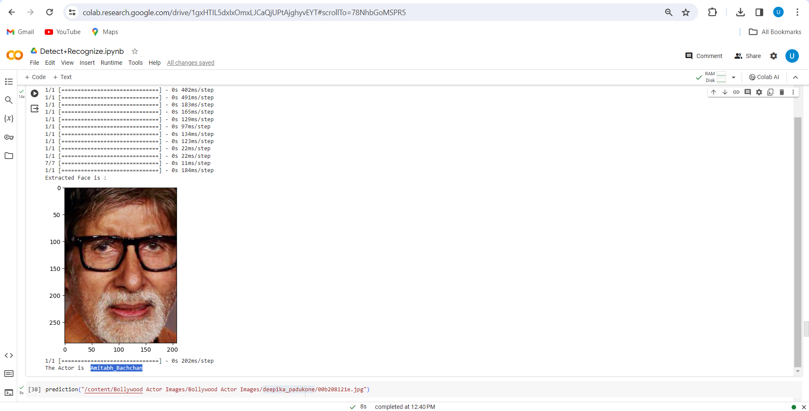
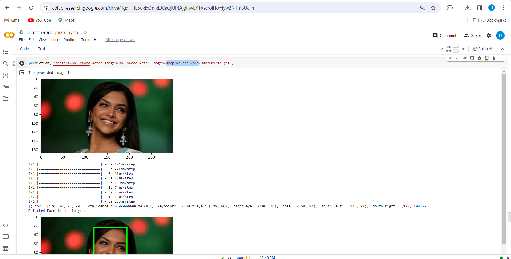
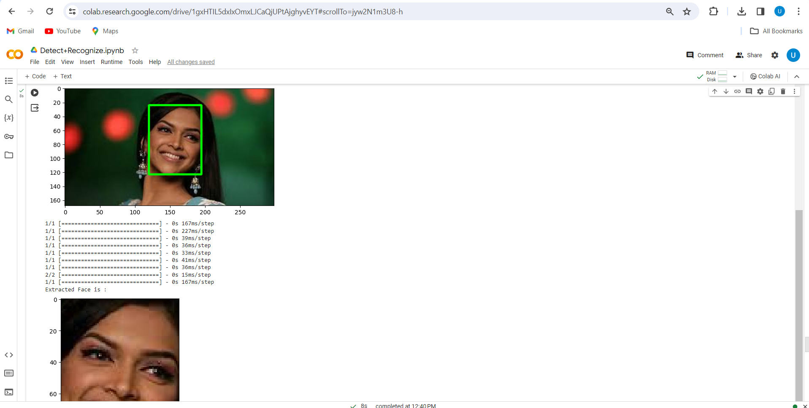
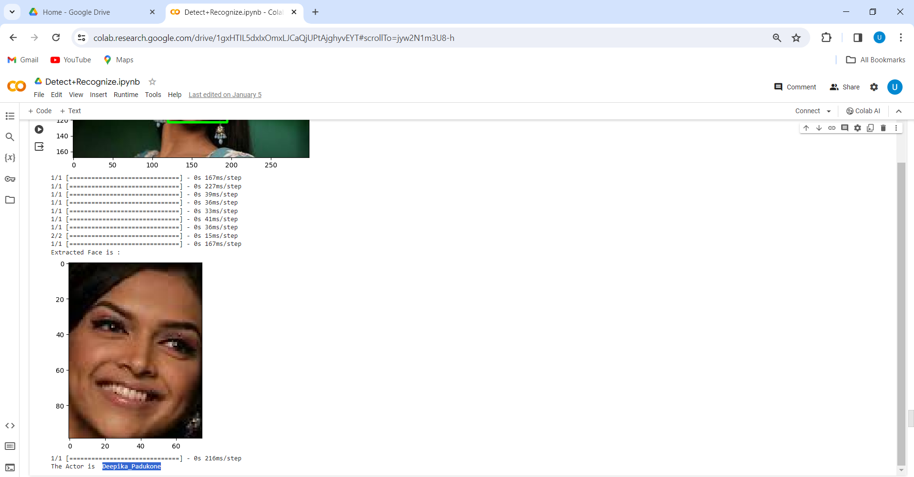
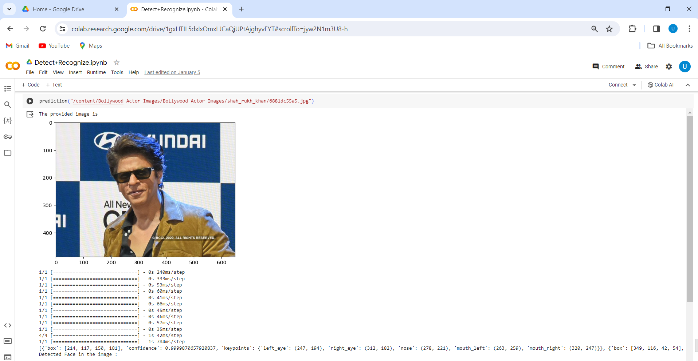
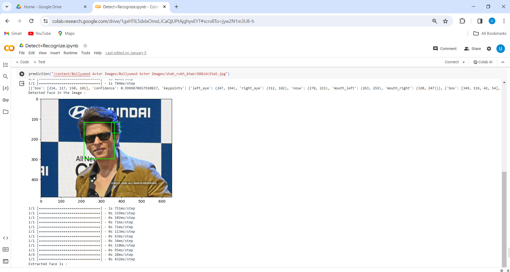
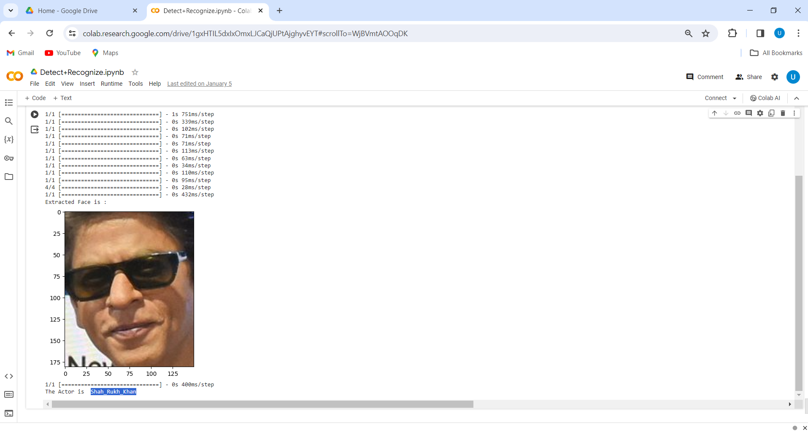

# Face Detection and Recognization system
- A Face Detection and Recognization system was built with the help of the 'Indian Actor Images Dataset' from Kaggle.
- The project is built using MTCNN and ArcFace Methodology with resnet50 as base.

### Following is the base approach
1. **Face Detection**
- From the given image of the celebrity, the system involves detecting the face with help of MTCNN by a bounding box and then extracting the bounded portion for recognization
- Special cases were considered in which the provided image will consist either no face or multiple faces.For 'no face' the process will stop at detection step and for multiple face scenerio the largest face in the image will be considered.
2. **Face Recognization**
- The Extracted face is passed to a Face recognization model built on ArcFace Methodology with Resnet50 as base model.
- The model will be externally trained on 'Bollywood celeb localized face dataset' that consist only the faces of bollowood actors for better learning of facial features.

**Following is the video link(linkedin post)**: https://www.linkedin.com/posts/urmil-pawar-024662252_codesoft-facerecognization-activity-7149347551362674689-QxGn?utm_source=share&utm_medium=member_desktop

### Following are the images

